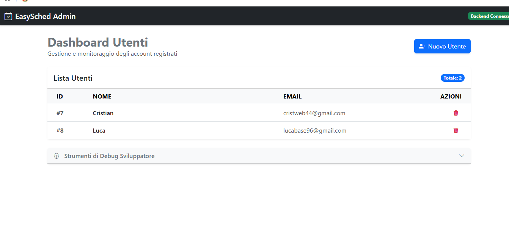

# 📅 EasySched Admin - Dashboard di Gestione Utenti

**EasySched** nasce per risolvere un problema comune: rendere la gestione, il monitoraggio e la pianificazione degli utenti all'interno di un sistema qualcosa di semplice, visivo e immediato. Niente più fogli di calcolo disordinati o database incomprensibili; un'interfaccia pulita per avere tutto sotto controllo con un click.

---

## 🎯 A cosa serve EasySched?
EasySched è un pannello di controllo centrale (Dashboard) pensato per gli amministratori di sistema. L'applicazione permette di:

* **Monitorare la Tabella Utenti:** Una visualizzazione chiara, pulita e in tempo reale di tutte le persone registrate nel sistema.
* **Gestione Semplificata:** Permette di amministrare i dati degli utenti in modo rapido, garantendo che le informazioni siano sempre aggiornate e prive di fronzoli (come l'interfaccia ottimizzata che mostra i nomi in modo chiaro e leggibile!).
* **Integrazione Futura:** La struttura è predisposta per l'aggiunta di moduli di messaggistica, calendari e pianificazione dei turni/appuntamenti.

---

## 🛠️ Il Cuore Tecnologico (Full-Stack Architecture)
Per garantire massima velocità e sicurezza, il progetto è stato diviso in due "anime" separate che comunicano tra loro tramite API REST:

### 💻 Il Frontend (L'Abito Grafico)
L'interfaccia utente è moderna, reattiva e si adatta a qualsiasi schermo (PC, Tablet o Smartphone).
* **Angular 17+ & TypeScript:** Il framework ideale per creare applicazioni web robuste. Sfrutta i nuovissimi Signals per aggiornare la pagina all'istante non appena i dati cambiano.
* **Bootstrap 5 & Icons:** Per un design elegante, pulito e professionale, con icone intuitive che guidano l'utente.

### ⚙️ Il Backend (Il Cervello)
La logica di business e la sicurezza dei dati sono gestite da un'infrastruttura solida come una roccia.
* **Java 21 & Spring Boot:** Il re del software aziendale, scelto per la sua incredibile velocità nel gestire le richieste del frontend.
* **Spring Data JPA & Hibernate:** Per dialogare con il database in modo intelligente, traducendo il codice Java direttamente in query SQL.
* **MySQL:** Il database relazionale che custodisce i dati degli utenti in modo sicuro e organizzato.

---

## 📸 Uno Sguardo all'Interfaccia
Ecco come si presenta la dashboard di EasySched in azione:

---

## 🚀 Guida all'avvio per i Recruiter (How to Run)

Essendo un'applicazione Full-Stack, il progetto è diviso in due moduli separati (Backend e Frontend). Segui questi passaggi per avviarlo in locale:

### 1. Prerequisiti
Prima di iniziare, assicurati di avere installato:
* **Java 21** (JDK 21)
* **Node.js** (versione 18 o superiore)
* **MySQL Server** attivo sul tuo computer

### 2. Configurazione e Avvio del Backend (Spring Boot)
1. Apri il tuo gestore MySQL (es. MySQL Workbench) e crea un database vuoto chiamato `easysched`:
sql
CREATE DATABASE easysched;

2. Configura le tue credenziali di MySQL (username e password) all'interno del file:  
backend/src/main/resources/application.properties

3. Avvia l'applicazione Spring Boot dal tuo IDE (Eclipse) oppure posizionati nella cartella backend da terminale e lancia il comando:
./mvnw spring-boot:run

*Il server si avvierà su http://localhost:8080. Grazie a Spring Data JPA, le tabelle verranno generate automaticamente.*

### 3. Configurazione e Avvio del Frontend (Angular)
1. Apri il terminale e posizionati dentro la cartella frontend.
2. Installa tutte le dipendenze lanciando il comando:
npm install

3. Avvia il server di sviluppo di Angular con il comando:
ng serve

4. Apri il tuo browser preferito e naviga all'indirizzo: http://localhost:4200

---

## Autore
* Cristian Bruno.
